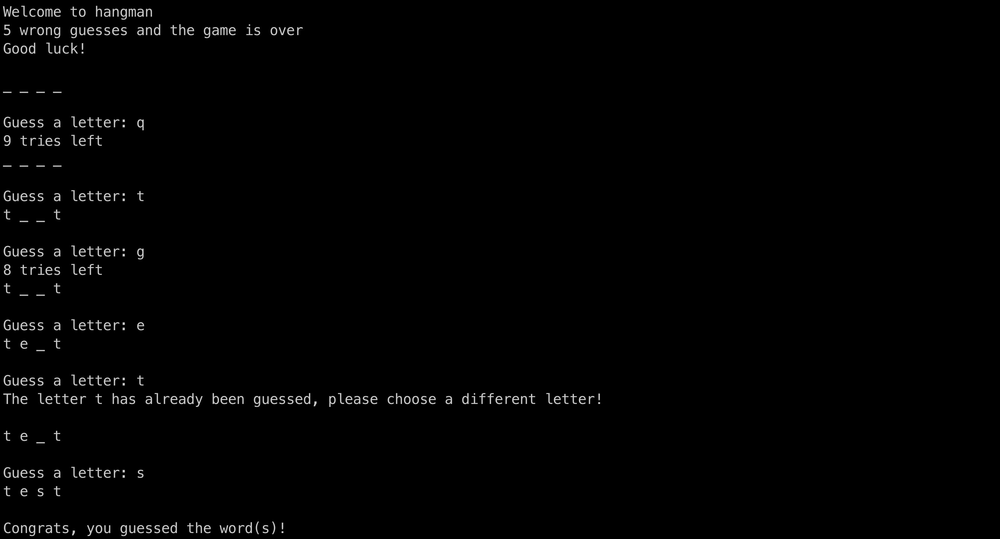

# Hangman-Sockets
Hangman-Sockets is a personal take on the classic game hangman using TCP sockets in Python with Pickle encoding/decoding.

## Preview
#### Client


## Features
- **Network-Based Gameplay**: Leverages TCP sockets for playing hangman over a network in a client-server setup.
- **Dynamic Word Input**: Server allows custom word or phrase input, offering varied and replayable game experiences.
- **Concurrency Support**: Utilizes threading to manage multiple client connections simultaneously for parallel gameplay.
- **Visible Progress Tracking**: The client interface displays the word's current state, updating with each successful guess.

## Usage
1. Clone the repository:
   ```bash
   git clone git@github.com:edwardinio18/Hangman-Sockets.git
2. Change `IP_ADDRESS` in `client.py` to match the IP address of your device on your local network (on Mac you can find this by running ```ifconfig | grep "inet "``` and on Windows by running ```ipconfig``` in the command prompt and looking for the IPv4 address under the network adapter you are using):
    ```bash
    cd Hangman-Sockets
    vim client.py
3. Start the server:
    ```bash
    python3 server.py
    ```
4. Start the client:
    ```bash
    python3 client.py
    ```

## Contributing
Contributions are welcome and greatly appreciated. If you have suggestions for improving this application, please fork the repo and create a pull request or open an issue.

1. Fork the Project
2. Create your Feature Branch (`git checkout -b feature/AmazingFeature`)
3. Commit your Changes (`git commit -m 'Add some AmazingFeature'`)
4. Push to the Branch (`git push origin feature/AmazingFeature`)
5. Open a Pull Request

## License
This project is licensed under the MIT License - see the [LICENSE](LICENSE) file for details.